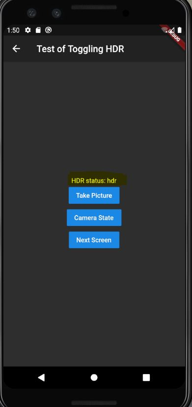
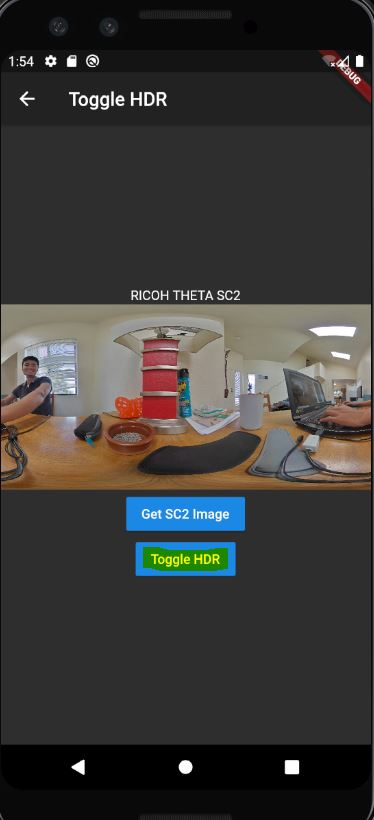
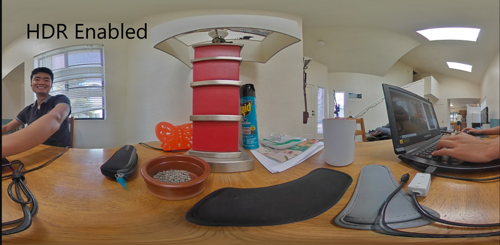
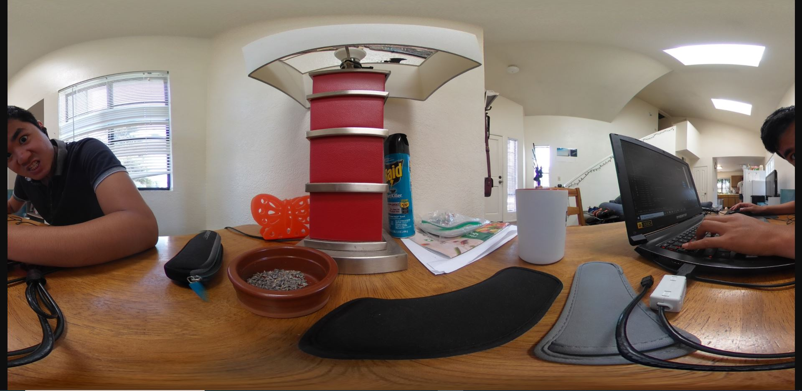

# Toggle the HDR Setting on the RICOH THETA V/SC2/Z1

This app uses the RICOH THETA API to toggle the HDR setting on the camera, and displays the current setting to the screen. 

## (Work in Progress)


## Getting Started

Hitting the 'Toggle HDR Button' will toggle between HDR settings and display the current setting to the home screen


This allows you to easily tell which HDR setting you are currently in: 



### The code
To toggle the HDR I first check for the current setting using the `getHdr()` function in `lib/toggle_hdr.dart`
```
Future<String> getHdr() async {
  var url = 'http://192.168.1.1/osc/commands/execute';

  Map data = {
    'name': 'camera.getOptions',
    'parameters': {
      'optionNames': [
        "_filter",
      ]
    }
  };

  //encode Map to JSON
  var body = jsonEncode(data);

  var response = await http.post(url,
      headers: {"Content-Type": "application/json;charset=utf-8"}, body: body);
  Map<String, dynamic> hdrType = jsonDecode(response.body);
  String hdrState = hdrType['results']['options']['_filter'];

  return hdrState;
}
```

I then toggle the HDR state using the `filterToggle` function

```
Future<String> filterToggle () async {
  var url ='http://192.168.1.1/osc/commands/execute';

  String hdrState = await getHdr();


//  Depending on hdr state, toggle between the two modes
  if (hdrState == 'off') {
    hdrState = 'hdr';
  }
  else {
    hdrState = 'off';
  }

//  Actually sets the hdr filter on or off
  Map data = {
    'name': 'camera.setOptions',
    'parameters': {
      'options': {
        "_filter": hdrState,
      }
    }
  };

  //encode Map to JSON
  var body = jsonEncode(data);

  var response = await http.post(url,
      headers: {"Content-Type": "application/json;charset=utf-8"},
      body: body
  );
 ```

## Next steps 
- Right now there is no way to tell if an image is "hdr" AFTER the picture is taken. Perhaps I could push metadata to the file to 
"mark" HDR pictures. 
- I want to display the current HDR setting when the app starts up. Currently, the text only updates when the HDR setting is toggled. 


A few resources to get you started if this is your first Flutter project:

- [Lab: Write your first Flutter app](https://flutter.dev/docs/get-started/codelab)
- [Cookbook: Useful Flutter samples](https://flutter.dev/docs/cookbook)

For help getting started with Flutter, view our
[online documentation](https://flutter.dev/docs), which offers tutorials,
samples, guidance on mobile development, and a full API reference.
