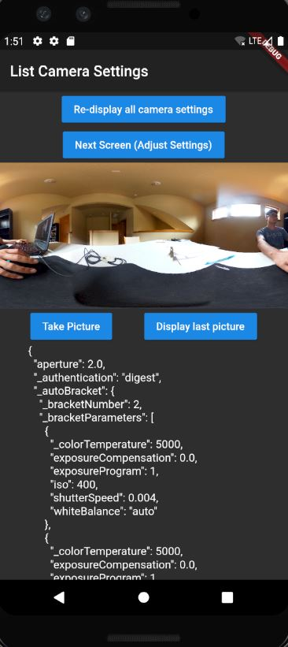
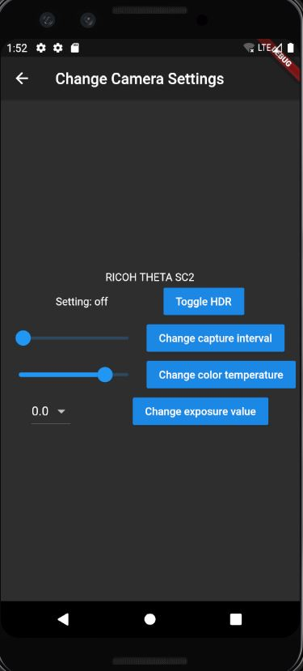

# List Camera Options Using the RICOH THETA SC2 and V

This app uses the RICOH THETA API to display all available camera options to the screen.
It also allows the user to change certain camera settings.

## (Work in Progress)
   


## Overview
On app startup the program displays all available camera settings to the screen. This is accomplished with the `camera.getOptions` command from the RICOH THETA API.

Unfortunately, some settings are only supported for the RICOH THETA V, some are only supported for the THETA SC2 and some settings don't work on either camera :(
See the table below for an overview of which commands are supported by camera model.

### The TABLE

SC2 and V | THETA V (only) | THETA SC2 (only) | Neither
 --------- | -------------- | ---------------- | ----------
'_autoBracket' |  '_authentication',  |  _function'    | _bluetoothClassicEnable
'_bitrate'   |  '_language',  |   _wlanChannel   |  _compositeShootingOutputInterval
'captureInterval'  |  '_microphone',  |      |  _compositeShootingTime
'captureMode'  |  '_microphoneChannel'  |      |  _HDMIreso
'captureNumber'  |  '_networkType'  |      |  _visibilityReduction
'clientVersion' |   '_shootingMethod'  |      |
'_colorTemperature' |   '_timeShift'  |      |
'dateTimeZone' |   '_topBottomCorrection'  |      |
'exposureCompensation' |   'videoStitching'  |      |
'exposureDelay' |   '_wlanFrequency'  |      |
'exposureProgram' |  _imageStitching  |      |
'fileFormat' |    |      |
'_filter' |    |      |
'_gain' |    |      |
gpsInfo' |    |      |
'iso' |    |      |
'isoAutoHighLimit' |    |      |
'_latestEnabledExposureDelayTime' |    |      |
'_maxRecordableTime' |    |      |
'offDelay' |    |      |
'previewFormat' |    |      |
'remainingPictures' |    |      |
'remainingSpace' |    |      |
remainingVideoSeconds' |    |      |
'shutterSpeed' |    |      |
'_shutterVolume' |    |      |
'sleepDelay' |    |      |
'totalSpace' |    |      |
whiteBalance' |  |   |
_bluetoothPower |   |   |

## The Code
I used the `info` command to retrieve the model of the camera. I then appended appended THETA V or THETA SC2 commands to the list of camera commands **based on the model number.** This keeps the app from breaking across multiple cameras.
```
if (cameraModel == 'RICOH THETA SC2') {
    optionNames.addAll(['_function',
      '_wlanChannel',
    ]);
  }
```
As a reminder, the relevant files can be found in the `lib` folder of this project. 

## Resources
A few resources to get you started if this is your first Flutter project
- [Video tutorials: Build a basic mobile app for the RICOH THETA SC2](https://youtu.be/Ayd8_FD2H58)
- [Resources: Documentation, tutorials, solutions, troubleshooting and more for the RICOH THETA SC2](https://theta360.guide/special/sc2/)

- [Lab: Write your first Flutter app](https://flutter.dev/docs/get-started/codelab)
- [Cookbook: Useful Flutter samples](https://flutter.dev/docs/cookbook)

